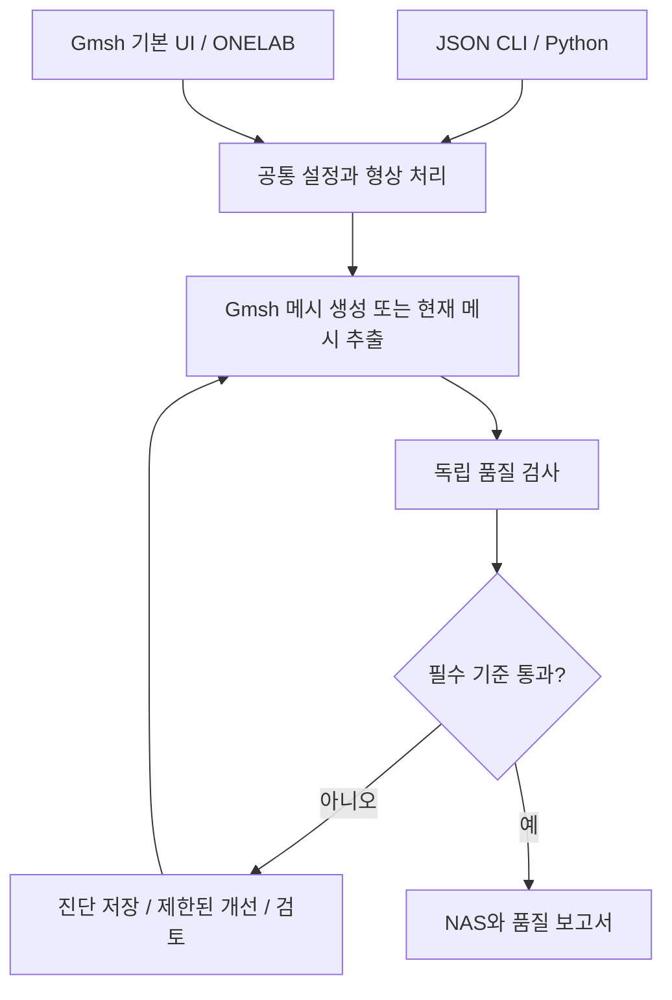

# BRL 메시 생성 기준·참고문헌·업데이트 계획

문서 버전: **0.1.0-draft** · 작성일: **2026-10-01 (Asia/Seoul)**

검토 코드: [`da4c56711aaea5388f4972558f69455c0d25a4c4`](https://github.com/BRL-AIML-students/BRL_AI_EM_convergence/commit/da4c56711aaea5388f4972558f69455c0d25a4c4)

대상: **1차 삼각형 표면 메시의 생성·검사·개선과 Gmsh 기본 UI**.

**이번 구현 범위:** 기준 문서, 검사·출력 게이트, 개선·기본 UI PR까지. MoM 연결과 해석 교정은 사용자 요청 전까지 작업·계획 범위에서 제외한다.

> **상태:** 이 파일은 공개용 기준 문서의 로컬 초안과 구현 계획이다. 아래에 표시한 제안 기준, Gmsh 기본 UI 연결과 T-junction 검사은 아직 구현·검증하지 않았다. 현재 메시 생성 기능과 구분해 읽어야 한다.

English overview: This draft documents the current meshing rules, proposed triangle-quality and conformity gates, evidence, validation limits, and an implementation/publication plan through the native Gmsh UI. Proposed thresholds are initial engineering policies, not universal MoM accuracy guarantees. Standard RWG use requires conforming connections; solver integration and electromagnetic calibration are out of scope until requested.

## 목차

1. [문서 형식과 범위](#format)
2. [현재 기능과 실행 경로](#current)
3. [현재 메시 생성에 적용되는 기준](#generation)
4. [현재 검사와 출력 기준](#assessment)
5. [종횡비 개선안과 허용 정책](#shape)
6. [T-junction·수밀성·연결 개선안](#junction)
7. [공통 엔진·Gmsh 기본 UI](#architecture)
8. [업데이트 전후 작업 계획과 완료 조건](#plan)
9. [검증 계획과 공개 범위](#validation)
10. [GitHub 적용 계획](#github)
11. [참고문헌과 근거의 적용 범위](#references)
12. [변경 이력](#history)

<a id="format"></a>

## 1. 문서 형식과 범위

### 권장 형식: 단일 Markdown 파일

공개 참고문서의 기준본은 **`docs/mesh-generation-guide.md` 하나**로 관리한다. GitHub에서 표·수식·목차를 읽고 변경 내용을 검토할 수 있다. 수식은 GitHub가 지원하는 LaTeX 표기를 사용한다. 독립 HTML은 기존 조사 결과의 보관용으로 유지하며, 같은 내용을 매번 수동으로 두 형식에 수정하지 않는다. 별도 HTML/PDF가 필요해지면 기준본에서 생성하도록 한다. [R12]

각 기준은 다음 항목을 함께 기록한다.

| 항목 | 기록할 내용 |
|---|---|
| 식별자·정의 | 예: SHAPE-01, 정규화와 수식이 명시된 종횡비 |
| 현재 상태 | `현재 구현`, `구현 제안`, `해석 검증 필요` |
| 값과 적용 범위 | 요소별 기준인지, 목표값인지, 단위·형상·정식화 범위 |
| 근거 | 코드 관찰, 원 논문, 공식 문서, 프로젝트 운영 정책 중 무엇인지 |
| 처리 | 측정·경고·출력 차단·예외 검토 중 어떤 동작인지 |
| 검증 | 수행 결과 또는 아직 수행하지 않은 검증 계획 |
| 버전 | 기준 프로필, 설정·보고서 형식, 검토 코드 커밋 |

표면 구조 검사의 통과, 선형방정식의 수렴, 메시 수렴, 참조 해와의 일치는 서로 다른 주장이다. 하나의 통과 상태로 합치지 않는다. 매질, 정식화, 기저, 적분, 주파수, 관심 출력과 오차 정의가 지정된 경우에만 해석 정확도 범위를 명시한다.

사용자가 제공한 교재 7.6절은 작은 내각·나쁜 종횡비를 피하고 노드를 공유하는 연결 및 폐곡면의 수밀성을 요구하는 출발점이다. 서명·저자·판·원 AR 정의가 미제공이므로 수치 임계값의 근거로 사용하지 않는다. 이 공개용 초안에는 제공된 번역 본문이나 교재 그림을 재수록하지 않는다.

<a id="current"></a>

## 2. 현재 기능과 실행 경로

현재 설치·사용 방법은 [README](../README.md), 실행·파일 계약은 [메시 인터페이스](mesh-interface.md)에 있다. 아래 내용은 검토 커밋의 코드 관찰이다.

| 기능 | 현재 상태 | 업데이트 목표 |
|---|---|---|
| 기본 형상·CAD·CSG | 판, 원판, 구, 상자, 원기둥, CAD, fuse/cut/intersect | 같은 입력을 공통 엔진과 기본 UI에서 사용 |
| 개별 메시 생성 | JSON CLI 및 브라우저 UI | Gmsh 기본 UI에서 BRL 설정과 진단도 사용 |
| 품질 검사 | 내각·q·크기·일부 형상 충실도·모서리 연결·NAS 확인 | 명시적 AR와 T-junction 기하 검사, 엄격한 품질 게이트 |
| 결과 | NAS, JSON/HTML 보고서, 로그 | 진단과 정상 운용 결과의 상태를 명확히 구분 |


현재 CLI 예:

```powershell
cd .\01_mesh_generator
..\.venv\Scripts\python.exe -m geometry_mesh.cli examples\plate_wave_local.json
```

현재 종료 코드 0은 생성·기존 품질 게이트·NAS 검증 완료, 1은 실행 오류, 2는 `invalid`를 뜻한다. **코드 0과 `complete`가 새 AR/T-junction 기준 통과나 MoM 정확도 검증을 뜻하지 않는다.** 새 기준을 적용할 때 이 계약과 기존 이용자의 호환성을 검토해야 한다.

<a id="generation"></a>

## 3. 현재 메시 생성에 적용되는 기준

근거 코드: [config.py](../01_mesh_generator/geometry_mesh/config.py), [sizing.py](../01_mesh_generator/geometry_mesh/sizing.py), [geometry.py](../01_mesh_generator/geometry_mesh/geometry.py), [pipeline.py](../01_mesh_generator/geometry_mesh/pipeline.py).

### GEN-01: 형상·단위

지원 길이 단위는 `m`, `cm`, `mm`, `um`이다. 기본 형상과 BREP에는 명시적 단위 변환을 적용하며, STEP/IGES는 CAD 단위 메타데이터와 OCC 대상 단위를 사용한다. BREP은 단위가 없는 입력으로 취급한다. 업데이트 전 각 경로에서 사용자가 선택한 입력 단위와 실제 CAD 단위의 의미를 설명하고 실측 치수를 검증한다.

### GEN-02–08: 크기·곡률·특징·예산

여기서 D는 전체 형상의 bounding-box 대각선 길이이다. 아래 기본 숫자는 **현재 프로젝트 설정값**이며 MoM 정확도를 보증하는 문헌 임계값이 아니다.

| 기준 | 현재 설정과 계산 | 의미와 한계 | 업데이트 전 검토 |
|---|---|---|---|
| GEN-02 기본 크기 | 자동: `0.06 × D`; fixed: `target_size` | 초기 목표 크기 | 형상군별 적절성, 실제 변 길이 초과량 |
| GEN-03 작은 특징 | CAD 곡선 길이와 면적 제곱근을 `2.5`로 나눠 후보 생성 | 기하 특징의 대리 지표 | 긴 좁은 면·급전·슬롯의 폭을 충분히 표현하는지 |
| GEN-04 최소 크기 | 기본 `0.0005 × D` | 지나친 요소 증가를 제한하는 하한 | 사용자 cap·작은 특징과 충돌할 때의 우선순위 |
| GEN-05 곡률 | 목표 편차 `0.002 × D`를 원주 샘플 수로 변환, 8–200 제한 | Gmsh 곡률 제어의 근사 설정 | 실제 CAD 편차와 같은 값이라고 표시하지 않기 |
| GEN-06 국소 세분화 | 기본 켜짐; 특징 선택 `0.25 × D`, 근처 크기 `0.25 × h`, 전이 거리 `0.15 × D`; 사용자 Box 지원 | Distance/Threshold 및 Box 크기장 | 작은 특징 보존, 급격한 크기 변화, 곡면 seam 제외 |
| GEN-07 좁은 갭 | 기본 꺼짐; 체적 bbox 간 양의 거리, 검색 `0.03 × D`, 3분할 | 정확한 표면 간 최소 거리가 아님; 열린 면 갭도 포괄하지 않음 | 슬롯·의도적 분리의 보호 기준, 정확한 기하 검출 범위 |
| GEN-08 요소 예산 | 기본 미지정; 표면적/정삼각형 면적 추정; `respect_features` 기본 | 실제 요소 수를 보장하지 않음 | 생성 후 실제 수 확인; 물리·기하 기준을 예산 때문에 조용히 완화하지 않기 |

현재 하한·cap·특징·파장·예산의 적용 순서를 문서와 코드에서 함께 확인한다. 예를 들어 최소 크기 하한이 사용자 cap보다 크면 cap보다 큰 목표가 남을 수 있다. 충돌을 숨기지 않고 `fail` 또는 `review_required`와 이유를 기록하는 정책을 설계한다. 국소 세분화가 켜진 경우 작은 특징 후보가 전역 크기에 그대로 적용되는 것은 아니다. 실제 특징 주변 크기는 목표 크기의 0.25와 특징 후보 중 작은 값을 선택한 뒤 최소 크기 하한을 적용하므로 표의 비율 하나만으로 결정되지 않는다.

### GEN-09: 파장 기반 크기

현재 파장 제어는 기본 꺼짐이다. 켜면 양의 실수 상대 유전율·투자율을 갖는 균일 무손실 매질의 위상 파장을 사용한다.

$$
\lambda=\frac{c_0}{f\sqrt{\varepsilon_r\mu_r}},\qquad h_{\lambda}=\frac{\lambda}{N_{\lambda}}.
$$

`elements_per_wavelength` 기본값은 10이다. 현재 생성 후 최대 변 길이의 파장 제한 초과 개수·비율을 보고하지만 모든 변의 정확한 상한을 강제하지는 않는다. **λ/10은 초기 해상도 설정이며 산란 오차 합격 기준이 아니다.** 손실·분산·여러 매질·주파수 sweep은 후속 해석기의 물리 모델과 함께 별도로 정의한다. 실제 해석 대상의 가장 제한적인 공간 스케일을 정하고, 파장 크기와 곡률·갭·급전 해상도를 함께 고려한다.

### GEN-10: Gmsh 생성 설정

현재 1차 요소, 삼각형 표면 생성, recombination 끄기, smoothing 3을 사용한다. 적용된 국소 크기장이 있으면 알고리즘 5, 없으면 6이다. `Mesh.Optimize=1`은 공식 문서상 사면체 최적화 설정이므로 삼각형 표면 AR 통과의 근거로 사용하지 않는다. 표면 최적화 후보는 `Relocate2D`와 `Laplace2D`이며, 각각 적용 후 독립 검사로 확인한다. [R9]

<a id="assessment"></a>

## 4. 현재 검사와 출력 기준

근거 코드: [quality.py](../01_mesh_generator/geometry_mesh/quality.py), [quality-v1.json](../01_mesh_generator/geometry_mesh/profiles/quality-v1.json), [nas.py](../01_mesh_generator/geometry_mesh/nas.py).

| 항목 | 현재 기준 | 현재 처리·제약 |
|---|---|---|
| 형상 경고 | 최소 내각 < 20° 또는 q < 0.35 | 요소 표시; 이 조건만으로 NAS 차단하지 않음 |
| 형상 점수 | 최소 각도 good 30°/bad 10°, q 1% 분위 good 0.70/bad 0.20 | 프로젝트 점수 매핑; MoM 오차율이나 합격 확률 아님 |
| 크기 | 가장 긴 변/목표의 95% 분위 good 1.25/bad 2.0, 요소 경고 1.5 | 통계 평가; 모든 변 상한 통과와 다름 |
| 크기 증가 | 인접 요소의 면적 제곱근 비, 기본 평가 한도 1.6 | 생성 제약이 아닌 사후 평가 |
| 면별 표현 | 기하 면당 삼각형 수 good 4/bad 1 | 작은 면 표현의 대리 지표; 임의 면의 충분한 해상도 보장 아님 |
| 기하 충실도 | 기본 형상의 면적 오차 1%, 체적 오차 2% 등 점수 기준 | 구에서는 삼각형 중심 chord 편차도 측정; 일반 CAD/CSG는 `not_assessed` |
| 구조 | 유한 좌표, 퇴화·중복 요소, 3면 이상 공유 모서리, 방향 불일치 | 구조적 fatal gate |
| 닫힘 | CAD 체적이 하나라도 있으면 전체 모델에 경계 모서리 0 요구 | 열린/닫힌 성분이 섞인 모델 의도를 표현하지 못함 |
| T-junction | 전용 정점–모서리 기하 검사 없음 | 노드 ID 기반 모서리 검사만으로 완전한 정합성 판정 불가 |
| NAS | 허용 카드, ID·좌표·연결·PID 비교와 pyNastran 재읽기 | 자유 필드 `GRID`, `CTRIA3`, 단일 `ENDDATA`; 현재 좌표 비교 절대 공차는 출력 단위에서 1e-12 |

현재 NAS의 PID는 표면 그룹 식별자이다. 재료·두께·전자기 경계조건을 나타내는 물성 카드가 아니다. MoM에 연결할 때 PID의 의미를 별도 계약으로 매핑해야 한다.

현재 구조·출력 게이트는 평균 점수로 상쇄하지 않는다. 업데이트에서는 형상·연결·크기·기하·출력의 측정 범위와 판정 상태를 각각 유지한다. 평가하지 않은 항목을 통과로 표시하지 않는다.

<a id="shape"></a>

## 5. 종횡비 개선안과 허용 정책

### SHAPE-01: 주 지표의 정의

변 길이 a,b,c, 가장 긴 변 L, 면적 A, 반둘레 s, 내접원 반지름 r에 대해 Verdict형 종횡비를 사용한다. [R3, §4.2]

$$
s=\frac{a+b+c}{2},\quad r=\frac{A}{s},\quad AR_V=\frac{L}{2\sqrt{3}r}=\frac{L(a+b+c)}{4\sqrt{3}A}.
$$

정삼각형은 1이다. 기존 mean-ratio도 유지한다.

$$
q=\frac{4\sqrt{3}A}{a^2+b^2+c^2},\qquad AR_F=\frac{1}{q}.
$$

`AR_F`는 Verdict의 aspect Frobenius 지표이며 `AR_V`와 다르다. FEKO의 긴 변/높이 AR도 정규화가 다르다. 기존 q < 0.35를 새 AR 상한과 같은 조건으로 바꾸지 않는다. [R3, R5]

이전 검토의 정규화된 긴 변/높이 지표와의 관계는 다음과 같다.

$$
AR_h=\frac{\sqrt{3}}{2}\frac{L}{h_{\min}}=\frac{\sqrt{3}L^2}{4A},\qquad \frac{AR_V}{AR_h}=\frac{a+b+c}{3L}.
$$

### SHAPE-02: 초기 허용 정책 — 구현·MoM 교정 전 제안

| 구분 | 요소별 조건 | 정책 | 근거의 지위 |
|---|---|---|---|
| 선호 목표 | AR_V ≤ 1.3 그리고 최소 내각 ≥ 30° | 가능한 영역에서 목표; 모든 요소에 강제하지 않음 | Verdict/CUBIT의 범용 품질 범위를 참고 |
| 기본 통과 | **AR_V ≤ 3 그리고 최소 내각 ≥ 20°** | 모든 요소와 다른 필수 게이트가 통과해야 정상 운용 출력 | 프로젝트 초기 운영 정책 |
| 심한 형상 불량 표시 | AR_V > 5 또는 최소 내각 < 15° | 추가 진단; 기본 기준 위반과 같이 정상 출력 차단 | **5·15°는 진단용 정책**, 보편 문헌 임계값 아님 |
| 초기 차단 | AR_V > 5 또는 최소 내각 < 15° | 정상 운용 출력 보류; 진단 보존 | 아직 교정하지 않은 운영 경계 |

Verdict 보고서의 AR 범위는 1–1.3, CUBIT 문서의 AR/Alpha 범위는 1–3이다. 명칭·정의와 범위의 차이도 있으므로 3을 문헌에서 입증한 MoM 한도로 표현하지 않는다. 20°는 현재 경고와 생성 제약을 참고한 초기 정책이다. 1.3을 의무 상한으로 삼으면 직각 이등변삼각형(AR_V ≈ 1.394)도 탈락한다. [R3, R4]

### SHAPE-03: 모든 요소 검사와 소수 예외

모든 삼각형을 검사하고 최대 AR, 최소·최대 내각, q, 면적, 개수·면적 비율, 표면·연결 성분별 분포와 인접 불량 군집을 기록한다. 최소 각도는 `atan2` 기반 계산을 후보로 검토하고, 퇴화·비정상 좌표는 먼저 처리한다.

**기본 위반 요소의 자동 허용 개수는 0개**이다. 평균·분위값이나 “전체의 0.1%” 같은 숫자로 자동 면제하지 않는다. 불량 형상은 EFIE의 조건 상태·기저 처리와 관련되지만 확인한 문헌은 안전한 허용 개수 비율을 제공하지 않는다. 급전·슬롯·갭·전류 집중부의 위치와 주변 RWG support도 검토한다. [R2, R5]

이번 범위에서는 개수·면적에 의한 예외나 승인 경로를 구현하지 않는다. 기준 위반은 모두 정상 출력 차단 대상으로 삼고 요소 ID·위치·군집과 개선 시도를 기록한다.

작은 실제 입력 각도 때문에 모든 요소가 목표를 만족할 수 없는 경우에는 반복 상한에 도달한 뒤 진단하고 종료한다. 원 형상을 임의로 깎거나 무한 재메시하지 않는다. [R8]

<a id="junction"></a>

## 6. T-junction·수밀성·연결 개선안

### TOPO-01: 허용 기준

전류가 연결되어야 하는 경계에서 한쪽의 AB 모서리와 다른 쪽의 AD·DB 분할이 일치하지 않는 hanging-node 결함을 T-junction으로 다룬다. 표준 RWG는 인접 삼각형 쌍의 공유 모서리에 기저를 구성한다. 비정합 연결의 지원에는 별도의 기저·testing과 해석기 검증이 필요하다. [R1, R6]

| 대상 | 제안 정책 |
|---|---|
| 확인된 비정합 T-junction | **0개**, 한 개도 개수 비율로 면제하지 않음 |
| 같은 위치의 다른 노드 ID | 실제 연결 의도 확인 후 공통 위상으로 복구 |
| 가까운 정점–모서리 후보 | 공차·CAD 연결 의도로 확인; 모호하면 `review_required` |
| 의도된 갭·슬롯·분리 도체 | 거리만으로 용접하지 않음 |
| 열린 표면의 정상 외곽·의도된 구멍 | 지정된 경계와 일치하면 허용 |
| 닫힌 표면 성분의 경계 모서리 | 0개 요구 |
| 실제 3면 이상의 물리 접합 | 결함과 구분; 후속 해석기 지원 없으면 미지원 접합으로 표시 |

### TOPO-02: 탐지

1. 연결 성분별 열린/닫힌 표면, 허용 경계, 의도된 도체 연결·분리와 PID 관계를 입력·기록한다.
2. 노드 ID 기반 모서리 incidence·방향·경계 루프와 정점 주변의 연결 fan을 검사한다.
3. BVH/AABB 등 공간 탐색으로 정점–모서리 후보, 일치 위치, 겹침·교차를 찾는다. 경계 모서리만 검사하는 것으로 최종 기하 검사를 대체하지 않는다.
4. 정점이 선분 내부로 투영되는지와 거리를 계산하고 CAD 연결 관계·부분 모서리 겹침을 대조한다. 굽은 표면의 정합 경계도 있으므로 양쪽 삼각형의 공면성을 필수 조건으로 삼지 않는다.
5. 확인·모호·의도적 분리·미지원 물리 접합을 구분하고 관련 ID와 근거를 저장한다.

$$
t=\frac{(v-a)\cdot(b-a)}{\|b-a\|^2},\qquad d=\|v-[a+t(b-a)]\|.
$$

영길이 모서리는 먼저 차단하고, `d ≤ τ` 및 선분 내부 투영으로 후보를 정한다. 끝점 제외 폭은 τ와 모서리 길이를 고려한다. 공간 탐색의 효율화가 검사 대상 일부를 생략하는 근거가 되어서는 안 된다.

### TOPO-03: 공차와 복구

$$
\tau=\max(\tau_{numeric},\tau_{abs},\tau_{rel}\ell_{local}).
$$

위 식은 검출 공차 설계의 출발점이다. 단위·좌표 정밀도·CAD 공차·국소 크기와 보호할 갭으로 상수를 교정해야 하며 아직 고정값을 선정하지 않았다. 전체 bbox만으로 공차를 정하지 않는다. **검출 공차와 자동 용접 공차는 별개**이며, 공차로 연결 의도 자체를 추정하지 않는다. 보호할 갭과 공차가 충돌하면 자동 복구를 보류한다.

복구는 CAD의 공유 경계 구성·imprint/fragment를 우선한다. Gmsh `occ.fragment`의 원본–출력 엔티티 대응을 사용해 PID를 보존한다. 이미 생성한 T-junction은 긴 모서리를 D에서 분할하고 양쪽을 같은 분할로 다시 삼각형화한다. 단순 stitch는 AB 대 AD+DB의 분할 불일치를 해결하지 못한다. 복구 후 AR·연결·법선·기하·PID 및 NAS 재읽기를 다시 검사한다. [R7, R9, R10]

CGAL은 판정·복구 설계의 참고 도구이다. 이번 계획에서 새 필수 의존성이나 특정 자동 복구 방법으로 확정하지 않았다.

<a id="architecture"></a>

## 7. 공통 엔진·Gmsh 기본 UI

아래는 목표 구조이며 현재 구현 구조가 아니다.



### 개별 생성·확인

Gmsh 기본 UI에서 숫자 파라미터로 기본 형상을 만들고 CAD를 가져오며 메시와 문제 위치를 확인한다. BRL 설정은 ONELAB 또는 실행 어댑터로 연결하고 공통 JSON 설정과 같은 의미를 유지한다. Gmsh UI가 모든 종류의 CAD를 임의 파라미터로 편집하는 기능까지 제공한다고 가정하지 않는다.

현재 pipeline은 생성 완료 후 Gmsh를 finalize한다. 대화형 실행에는 세션 수명과 생성·추출·검사·저장을 분리하는 작업이 필요하다. Gmsh FLTK 이벤트 루프는 main thread에서 실행해야 하므로 기존 브라우저 서버의 worker thread에서 기본 UI를 직접 여는 방식으로 연결하지 않는다. 전용 대화형 실행 프로세스 또는 main-thread 어댑터를 우선 검토한다. [R9]

GUI에서 형상·설정·노드·요소를 변경하면 이전 품질 판정과 예외 증거를 무효화한다. 마지막에 검사한 메시와 실제 출력할 메시가 같은지 확인한다. GUI의 일반 저장 기능으로 만든 외부 메시도 후속 MoM 경로에 들어갈 때 다시 검사한다.

### 공통 Python 실행 경로

CLI와 기본 UI는 같은 설정 검증·메시 추출·품질 검사·NAS 검증을 호출한다. 생성 완료와 필수 품질 통과는 별도 상태로 기록한다. GUI에서 마지막에 검사한 메시와 실제 저장할 메시지의 동일성을 확인한다. MoM 연결·교정은 이번 범위에 포함하지 않는다.

<a id="plan"></a>

## 8. 업데이트 전후 작업 계획과 완료 조건

| 순서 | 작업과 예상 변경 위치 | 결과물·완료 조건 |
|---|---|---|
| 0. 기준 문서 초안 | 이 파일에 현재 기준·제안·근거·한계 통합 | 수식·기본값·출처·상태 구분과 상대 링크 확인; 이번 수행 범위 |
| 1. 적용 계약 확정 | 설정·프로필·보고서 설계, `config.py`, schema, `mesh-interface.md` | 열린/닫힌 성분·연결 의도·보호할 갭·우선순위·차단·예외·종료 코드·버전 정책 정의 |
| 2. 독립 검사기 | `quality.py`, 필요시 전용 topology 모듈 | AR 전수 검사, 견고한 각도 계산, T-junction과 연결 판정; 알려진 정상/이상 입력을 구분 |
| 3. 출력 게이트 | `pipeline.py`, `reporting.py`, 품질 프로필 | 형상·연결 위반을 정상 결과로 발행하지 않음; 진단 보존; 미평가 항목 표시; NAS 재검사 |
| 4. 개선과 생성 규칙 | `geometry.py`, `sizing.py`, pipeline | 공유 경계·PID 보존, 표면 최적화·국소 재메시, 크기 충돌 처리; 모든 수정 후 재검사 |
| 5. Gmsh 기본 UI | 대화형 실행 어댑터·ONELAB, 세션 수명 분리 | 기본 형상 숫자 입력·CAD 불러오기·문제 요소 선택·현재 메시 검사·출력; main-thread 동작 확인 |
| 6. 독립 실행·공통 Python API | 생성·현재 메시 검사·NAS 저장 API | CLI·브라우저·Gmsh 기본 UI에서 동일 검사와 출력 게이트 |
| 7. 기하·실행 검증 | 독립 검사 사례·회귀·대표 CAD·기본 UI | 정상/불량 판정, 개선 전후, 단위/PID와 실행 경로 검증 |
| 8. GitHub 적용 | 기준 문서, README 링크, 인터페이스·검증 기록, 소스/설정 변경 | 문서 초안과 구현 PR의 범위 구분; 원격 읽기·CI 확인; 병합/릴리스 상태를 실제 상태대로 기록 |

1–3을 먼저 완료해야 4–6의 출력과 수동 조작에 같은 기준을 적용할 수 있다. 공개 범위는 기하 검사·개선·기본 UI이며 해석 정확도를 검증했다고 표시하지 않는다.

개선 반복에는 횟수·요소 수·실행 시간 상한을 둔다. 예를 들어 최대 3회는 검토 가능한 초기 운영값이며 정확도 보증이 아니다. 상한에 도달하거나 실제 형상·갭 보존과 충돌하면 진단하고 종료한다. 균등 세분화만으로 닮은 불량 요소를 반복 생성하지 않도록 국소 배치·제약을 함께 검토한다.

### 구현에 영향을 주는 미확정 정보

| 정보 | 필요한 단계 | 결정 전 수행 가능한 일 |
|---|---|---|
| CAD 연결 의도·보호할 최소 갭·공차 | 자동 T-junction 복구 | 후보 탐지와 모호 상태 표시 |
| 배포·재사용 및 의존성 라이선스 정책 | 최종 공개·배포 문서 | 원 논문·공식 문서 링크와 프로젝트가 작성한 설명 정리 |

필수 정보가 없는 단계만 보류하고, 다른 독립 작업은 계속할 수 있도록 설계한다.

<a id="validation"></a>

## 9. 검증 계획과 공개 범위

### 9.1 현재 검증 기록과 새 검증을 분리

[기존 검증 기록](VALIDATION.md)은 2026-09-30 환경에서 Python 테스트 25개와 NAS 뷰어·설치·브라우저 동작을 확인했다고 기록한다. **이번 문서 작성에서 이를 재실행하지 않았다.** 기존 기록은 새 AR/T-junction 검사나 MoM 정확도의 검증 결과가 아니다.

### 9.2 필요한 구조·회귀 검증

- 정삼각형·직각·바늘형·거의 180°·영면적 요소에서 AR와 각도의 알려진 결과를 확인한다. 다른 단위·큰 좌표 오프셋·정점 순서도 포함한다.
- 정합 AB 분할과 비정합 AD/DB, 일치 위치의 다른 ID, 끝점 근처, 부분 겹침, 굽은 접합, 의도적 근접 갭을 구별한다.
- 열린 판의 외곽·의도된 구멍·내부 균열, 닫힌 구의 면 누락, 열린/닫힌 성분 혼합과 미지원 물리 접합을 검사한다.
- CAD fragment·국소 개선 후 형상·PID·갭이 보존되는지 확인하고 NAS 재읽기에서도 같은 판정을 얻는다.
- CLI, Python, 기존 브라우저 UI 및 Gmsh 기본 UI에서 미통과 메시가 정상 운용 경로로 전달되지 않는지 확인한다.
- 큰 메시의 탐색 시간·메모리·후보 누락을 확인하고 자원 상한 도달 상태를 기록한다.

### 9.3 범위

이번 검증은 형상·연결·출력·실행 경로에 한정한다. 전자기 해석, MoM 연결, AR의 해석 교정은 수행하거나 후속 작업으로 예약하지 않는다.

<a id="github"></a>

## 10. GitHub 적용 계획

### 공개 위치와 문서 구성

2026-10-01 읽기 전용 조회에서 현재 canonical 저장소는 [`BRL-AIML-students/BRL_AI_EM_convergence`](https://github.com/BRL-AIML-students/BRL_AI_EM_convergence), 공개 상태는 public, 기본 브랜치는 `main`이다. 이전 `HyunJoong-Kim-cnu` 주소도 같은 저장소 ID로 해석된다. 로컬 `docs/DEVELOPMENT.md`에는 이전 소유자 주소가 남아 있으므로 공개 문서 정리 때 함께 갱신한다.

이 파일은 생성 기준·근거·한계의 단일 기준본이다. README에는 이 파일 링크만 추가한다. 기존 `mesh-interface.md`는 실행·파일 계약을, `VALIDATION.md`는 실제 수행 결과를 유지한다. 참고문헌 설명을 여러 파일에 중복 관리하지 않는다.

### 공개 적용 순서

1. **문서 PR:** 이 기준 문서 초안을 검토하고 README의 접근 링크 및 저장소 주소를 정리한다. 미구현 제안은 draft/proposed로 공개한다.
2. **검사·게이트 PR:** 새 검사와 설정/보고서 계약·회귀 검증을 포함한다. 문서의 구현 상태를 실제 기능과 동시에 갱신한다.
3. **개선·기본 UI PR:** 공유 경계·국소 개선·세션 수명·ONELAB 동작을 검증한다. 각 PR은 앞 단계에 의존하며 검토 가능한 범위로 나눈다.
4. 게시 후 GitHub의 파일·링크·수식·PR/CI 상태를 확인한다. 브랜치 업로드, PR 생성, main 병합, 릴리스 게시를 각각 실제 완료 상태로 보고한다.

게시할 파일은 검토된 문서·코드·설정·작은 재현 예제에 한정한다. 원 교재·논문 PDF, 개인 CAD, 출력·로그·캐시·가상환경을 문서 참고용이라는 이유로 함께 올리지 않는다. 참고문헌은 서지·DOI·공식 링크와 사용 범위를 기록한다.

코드·문서와 의존성의 라이선스·출처를 확인하고 프로젝트의 공개 재사용 정책을 명시한다. 로컬 루트에서 LICENSE 파일을 확인하지 못했으므로 임의의 라이선스를 새로 적용하지 않았다. GitHub 조회·공개 문서 확인은 수행했으나 **이번 계획 단계에서 commit/push/PR 생성/병합은 수행하지 않았다.**

<a id="references"></a>

## 11. 참고문헌과 근거의 적용 범위

문헌 검토는 2026-09-30 조사에 기반하며, GitHub 기능·저장소 메타데이터는 2026-10-01에 추가 확인했다. 검색 후보 수는 전문을 검토한 논문 수가 아니다. 원 논문·저자 공개 원고·공식 문서를 우선하며, 아래 열람 범위를 넘어선 수치 임계값을 출처에 귀속하지 않는다.

| Ref | 출처·버전·접근 링크 | 채택한 근거와 한계 |
|---|---|---|
| R1 | Rao, Wilton, Glisson, *Electromagnetic Scattering by Surfaces of Arbitrary Shape*, IEEE TAP 30(3), 409–418, 1982. [대학 공개 원 논문](https://home.cc.umanitoba.ca/~lovetrij/cECE7810/Papers/RaoWiltonGlisson.pdf) | 도입·정식화 확인. 공유 모서리의 RWG와 전류 연속성. 숫자 AR 상한 근거 아님. |
| R2 | Stephanson & Lee, *Automatic Basis Function Regularization for Integral Equations in the Presence of Ill-Shaped Mesh Elements*, IEEE TAP 61(8), 4139–4147, 2013. [DOI 10.1109/TAP.2013.2260118](https://doi.org/10.1109/TAP.2013.2260118) | 초록·공개 서론 확인. EFIE 불량 형상과 기저 정칙화. 상세 수치 예제 미확보; 허용 AR·백분율을 귀속하지 않음. |
| R3 | *The Verdict Geometric Quality Library*, SAND2007-1751, Printed March 2007, §4.2–4.3. [DOE 공개 보고서](https://www.osti.gov/servlets/purl/901967) | AR_V와 aspect Frobenius 수식·범위 1–1.3. 범용 기하 지표; MoM 정확도 보증 아님. 서지 웹 연도와 달리 사용 버전은 PDF 표지로 고정. |
| R4 | CUBIT 17.10, *Metrics for Triangular Elements*. [공식 문서](https://cubit.sandia.gov/files/cubit/17.10/help_manual/WebHelp/mesh_generation/mesh_quality_assessment/triangular_metrics.htm) | AR/Alpha 1–3·최소 내각 30–60°. 정의 설명은 approximate; R3와 차이를 명시. |
| R5 | Altair FEKO 2024, [Distorted Mesh Elements](https://help.altair.com/2024/feko/topics/feko/user_guide/cadfeko/search_mesh_distorted_elements_feko_t-cadfeko.htm); FEKO 2025, [Advanced Meshing Options](https://help.altair.com/2025/feko/topics/feko/user_guide/cadfeko/mesh_options_advanced_feko_r-cadfeko.htm) | 작은 내각·MoM 조건 상태 및 긴 변/높이 정의. 삼각형과 voxel 기준을 구별; 보편 AR 상한 근거 아님. |
| R6 | Úbeda, Rius, Heldring, Sekulic, *Volumetric Testing Parallel to the Boundary Surface for a Nonconforming Discretization of the Electric-Field Integral Equation*, 2015. [DOI 10.1109/TAP.2015.2426793](https://doi.org/10.1109/TAP.2015.2426793), [저자 대학 원고](https://upcommons.upc.edu/bitstreams/83867262-f2c1-46f2-997d-e84a789fd30c/download) | accepted 2015-04-18 저자 교정 원고. 비정합에 표준 RWG 적용 불가와 특수 기저/testing. 일반 경로의 T-junction 면제 근거 아님. |
| R7 | FEKO 2025, [Mesh Connectivity](https://help.altair.com/2025/feko/topics/feko/user_guide/editfeko/meshing_guidelines_connectivity_feko_c-editfeko.htm); FEKO 2024, [Electrical Connectivity](https://2024.help.altair.com/2024/feko/topics/feko/user_guide/cadfeko/electrical_connectivity_feko_c-cadfeko.htm) | 공유 모서리·연결 geometry, union/stitch/imprint의 역할. |
| R8 | Shewchuk, [Triangle 공식 -q](https://www.cs.cmu.edu/~quake/triangle.q.html); *Delaunay Refinement Algorithms for Triangular Mesh Generation*, 2001-05-21 [저자 원고](https://people.eecs.berkeley.edu/~jrs/papers/2dj.pdf) | 입력 작은 각도에 따른 생성 한계. 평면 알고리즘의 각도·종료 보장을 Gmsh 3D 표면으로 옮기지 않음. |
| R9 | Gmsh 4.15.2 Reference Manual, 2026-03-24 버전. [mesh API](https://gmsh.info/doc/texinfo/gmsh.html#Namespace-gmsh_002fmodel_002fmesh), [OCC API](https://gmsh.info/doc/texinfo/gmsh.html#Namespace-gmsh_002fmodel_002focc), [FLTK](https://gmsh.info/doc/texinfo/gmsh.html#Namespace-gmsh_002ffltk), [Mesh options](https://gmsh.info/doc/texinfo/gmsh.html#Mesh-options) | 2D 최적화·fragment·main-thread UI. 동일 로컬 Python API와 대조. 설치 버전을 고정하며 온라인 문서 개정 가능성 고려. |
| R10 | CGAL 6.1, [Polygon Mesh Processing](https://doc.cgal.org/6.1/Polygon_mesh_processing/index.html), [Combinatorial repair](https://doc.cgal.org/6.1/Polygon_mesh_processing/group__PMP__combinatorial__repair__grp.html), [Corefinement](https://doc.cgal.org/6.1/Polygon_mesh_processing/group__PMP__corefinement__grp.html) | 위상/기하 구별, stitch 대상, 교차·정확 판정의 역할. 자동 복구가 MoM 유효성까지 보장한다고 해석하지 않음. |
| R11 | Shewchuk, *What is a Good Linear Element? Interpolation, Conditioning, and Quality Measures*. [저자 원고](https://people.eecs.berkeley.edu/~jrs/papers/elem.pdf); Pébay & Baker, *Analysis of triangle quality measures*, Math. Comp. 72, 1817–1839, 2003. [DOI 10.1090/S0025-5718-03-01485-6](https://doi.org/10.1090/S0025-5718-03-01485-6) | 지표의 목적 의존성과 수학적 비교. 전자는 주로 FEM이며 파일 날짜 미확정, 후자는 초록·서지 열람. 직접 MoM 임계값으로 사용하지 않음. |
| R12 | GitHub Docs, [Working with non-code files](https://docs.github.com/en/repositories/working-with-files/using-files/working-with-non-code-files), [Writing mathematical expressions](https://docs.github.com/en/get-started/writing-on-github/working-with-advanced-formatting/writing-mathematical-expressions), 2026-10-01 열람 | Markdown 표시·문서 diff·수식 표기의 근거. |

현재 기본값과 점수의 직접 근거는 해당 커밋의 코드·프로필이다. 외부 문헌이 `scale_fraction=0.06`, q 경고 0.35, 성장 평가 1.6, λ/10 또는 예외 경계 5·15°를 보편적으로 검증했다고 표현하지 않는다.

<a id="history"></a>

## 12. 변경 이력

| 문서 버전 | 날짜 | 변경 | 구현·검증 상태 |
|---|---|---|---|
| 0.1.0-draft | 2026-10-01 | 현재 생성·검사 기준, AR/T-junction 제안, 기본 UI, 기하 검증·GitHub 계획을 단일 파일에 통합 | 문서 작성과 코드·공식 문서 조회만 수행. 제안 기능 구현·새 테스트·MoM 교정·GitHub 게시 미수행 |

향후 변경 때는 문서 버전, 정책 프로필 버전, 검토 코드와 실제 검증 결과를 함께 갱신한다. 기준 숫자의 변경에는 정의·적용 범위·근거·전후 검증을 기록한다.
