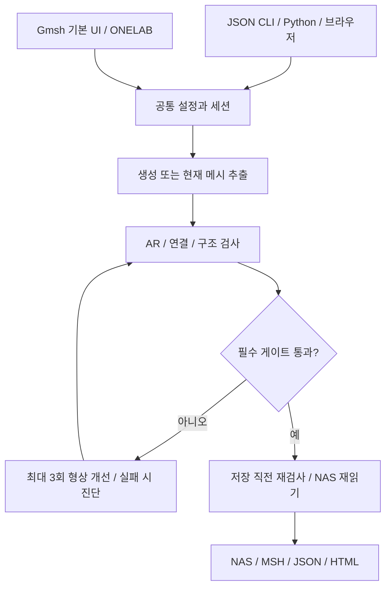

# BRL 메시 생성 기준·참고문헌·업데이트 계획

문서 버전: **0.2.0** · 갱신일: **2026-10-01 (Asia/Seoul)**

기존 구현 기준점: [`da4c567`](https://github.com/BRL-AIML-students/BRL_AI_EM_convergence/commit/da4c56711aaea5388f4972558f69455c0d25a4c4). 검사·게이트 구현: [`008089c`](https://github.com/BRL-AIML-students/BRL_AI_EM_convergence/commit/008089cb01705d96c31371f5be3613cdb012d040). 개선·기본 UI: `codex/mesh-improvement-native-ui` 브랜치.

대상: **1차 삼각형 표면 메시의 생성·검사·개선과 Gmsh 기본 UI**.

**이번 구현 범위:** 기준 문서, 검사·출력 게이트, 개선·기본 UI PR까지. MoM 연결과 해석 교정은 사용자 요청 전까지 작업·계획 범위에서 제외한다.

> **상태:** AR·최소 내각 전수 검사, 정점–모서리 정합성 검사, 출력 게이트, 제한된 표면 개선과 Gmsh ONELAB 패널을 구현했다. 일반적인 삼각형 면 교차 검사, 임의 메시 T-junction 자동 복구 및 일반 CAD 형상 충실도 평가는 제공하지 않는다. PR의 기능과 main의 기능은 병합 전까지 구분한다.

English overview: This guide documents implemented meshing rules, all-element triangle-quality gates, vertex-edge conformity checks, bounded relocation, explicit open-CAD fragment, and native Gmsh/ONELAB operation. Thresholds are initial engineering policies, not universal MoM accuracy guarantees. General face intersections and arbitrary existing-mesh T-junction repair are not assessed. Solver integration and electromagnetic calibration are out of scope until requested.

## 목차

1. [문서 형식과 범위](#format)
2. [현재 기능과 실행 경로](#current)
3. [현재 메시 생성에 적용되는 기준](#generation)
4. [현재 검사와 출력 기준](#assessment)
5. [종횡비 개선안과 허용 정책](#shape)
6. [T-junction·수밀성·연결 개선안](#junction)
7. [공통 엔진·Gmsh 기본 UI](#architecture)
8. [업데이트 전후 작업 계획과 완료 조건](#plan)
9. [검증 계획과 공개 범위](#validation)
10. [GitHub 적용 계획](#github)
11. [참고문헌과 근거의 적용 범위](#references)
12. [변경 이력](#history)

<a id="format"></a>

## 1. 문서 형식과 범위

### 권장 형식: 단일 Markdown 파일

공개 참고문서의 기준본은 **`docs/mesh-generation-guide.md` 하나**로 관리한다. GitHub에서 표·수식·목차를 읽고 변경 내용을 검토할 수 있다. 수식은 GitHub가 지원하는 LaTeX 표기를 사용한다. 독립 HTML은 기존 조사 결과의 보관용으로 유지하며, 같은 내용을 매번 수동으로 두 형식에 수정하지 않는다. 별도 HTML/PDF가 필요해지면 기준본에서 생성하도록 한다. [R12]

각 기준은 다음 항목을 함께 기록한다.

| 항목 | 기록할 내용 |
|---|---|
| 식별자·정의 | 예: SHAPE-01, 정규화와 수식이 명시된 종횡비 |
| 현재 상태 | `현재 구현`, `구현 제안`, `해석 검증 필요` |
| 값과 적용 범위 | 요소별 기준인지, 목표값인지, 단위·형상·정식화 범위 |
| 근거 | 코드 관찰, 원 논문, 공식 문서, 프로젝트 운영 정책 중 무엇인지 |
| 처리 | 측정·경고·출력 차단·예외 검토 중 어떤 동작인지 |
| 검증 | 수행 결과 또는 아직 수행하지 않은 검증 계획 |
| 버전 | 기준 프로필, 설정·보고서 형식, 검토 코드 커밋 |

표면 구조 검사의 통과, 선형방정식의 수렴, 메시 수렴, 참조 해와의 일치는 서로 다른 주장이다. 하나의 통과 상태로 합치지 않는다. 매질, 정식화, 기저, 적분, 주파수, 관심 출력과 오차 정의가 지정된 경우에만 해석 정확도 범위를 명시한다.

사용자가 제공한 교재 7.6절은 작은 내각·나쁜 종횡비를 피하고 노드를 공유하는 연결 및 폐곡면의 수밀성을 요구하는 출발점이다. 서명·저자·판·원 AR 정의가 미제공이므로 수치 임계값의 근거로 사용하지 않는다. 이 공개 문서에는 제공된 번역 본문이나 교재 그림을 재수록하지 않는다.

<a id="current"></a>

## 2. 현재 기능과 실행 경로

현재 설치·사용 방법은 [README](../README.md), 실행·파일 계약은 [메시 인터페이스](mesh-interface.md)에 있다. 아래 내용은 검토 커밋의 코드 관찰이다.

| 기능 | 이 PR 묶음의 동작 | 적용 범위 |
|---|---|---|
| 기본 형상·CAD·CSG | 판, 원판, 구, 상자, 원기둥, CAD, fuse/cut/intersect | ONELAB 숫자 패널은 기본 형상/CAD; CSG는 JSON CLI |
| 개별 메시 생성 | JSON CLI, 브라우저 UI, Gmsh 기본 UI | 같은 공통 생성·검사·저장 경로 |
| 품질 검사 | AR·내각·q·크기·일부 형상 충실도·정합성·NAS 확인 | 정점–모서리 검사 범위와 미평가 항목 명시 |
| 결과 | 정상 NAS, 진단 MSH, JSON/HTML 보고서, 로그 | 실패·검토 필요 결과는 진단만 발행 |


현재 CLI 예:

```powershell
cd .\01_mesh_generator
..\.venv\Scripts\python.exe -m geometry_mesh.cli examples\plate_wave_local.json
```

CLI 종료 코드 0은 생성·v2 품질 게이트·NAS 검증 완료, 1은 실행 오류, 2는 `invalid`를 뜻한다. **코드 0과 `complete`는 구현된 기하·출력 검사의 통과이며 MoM 정확도 검증이 아니다.** 기존 설정에도 새 기본 게이트가 적용되어 예전 출력이 이제 차단될 수 있다. 기본 UI의 대화형 종료 코드는 개별 작업의 합격 판정이 아니므로 Result와 보고서를 확인한다.

<a id="generation"></a>

## 3. 현재 메시 생성에 적용되는 기준

근거 코드: [config.py](../01_mesh_generator/geometry_mesh/config.py), [sizing.py](../01_mesh_generator/geometry_mesh/sizing.py), [geometry.py](../01_mesh_generator/geometry_mesh/geometry.py), [pipeline.py](../01_mesh_generator/geometry_mesh/pipeline.py).

### GEN-01: 형상·단위

지원 길이 단위는 `m`, `cm`, `mm`, `um`이다. 기본 형상과 BREP에는 명시적 단위 변환을 적용하며, STEP/IGES는 CAD 단위 메타데이터와 OCC 대상 단위를 사용한다. BREP은 단위가 없는 입력으로 취급한다. 기본 UI의 BRL CAD 경로도 이 변환을 사용한다. Gmsh File/Open으로 이미 불러온 모델을 검사하는 경로는 좌표를 변환하지 않고 선택된 출력 단위로 해석한다. 실제 CAD 치수를 확인해야 한다.

### GEN-02–08: 크기·곡률·특징·예산

여기서 D는 전체 형상의 bounding-box 대각선 길이이다. 아래 기본 숫자는 **현재 프로젝트 설정값**이며 MoM 정확도를 보증하는 문헌 임계값이 아니다.

| 기준 | 현재 설정과 계산 | 의미와 한계 | 적용 시 확인할 항목 |
|---|---|---|---|
| GEN-02 기본 크기 | 자동: `0.06 × D`; fixed: `target_size` | 초기 목표 크기 | 형상군별 적절성, 실제 변 길이 초과량 |
| GEN-03 작은 특징 | CAD 곡선 길이와 면적 제곱근을 `2.5`로 나눠 후보 생성 | 기하 특징의 대리 지표 | 긴 좁은 면·급전·슬롯의 폭을 충분히 표현하는지 |
| GEN-04 최소 크기 | 기본 `0.0005 × D` | 지나친 요소 증가를 제한하는 하한 | 사용자 cap·작은 특징과 충돌할 때의 우선순위 |
| GEN-05 곡률 | 목표 편차 `0.002 × D`를 원주 샘플 수로 변환, 8–200 제한 | Gmsh 곡률 제어의 근사 설정 | 실제 CAD 편차와 같은 값이라고 표시하지 않기 |
| GEN-06 국소 세분화 | 기본 켜짐; 특징 선택 `0.25 × D`, 근처 크기 `0.25 × h`, 전이 거리 `0.15 × D`; 사용자 Box 지원 | Distance/Threshold 및 Box 크기장 | 작은 특징 보존, 급격한 크기 변화, 곡면 seam 제외 |
| GEN-07 좁은 갭 | 기본 꺼짐; 체적 bbox 간 양의 거리, 검색 `0.03 × D`, 3분할 | 정확한 표면 간 최소 거리가 아님; 열린 면 갭도 포괄하지 않음 | 슬롯·의도적 분리의 보호 기준, 정확한 기하 검출 범위 |
| GEN-08 요소 예산 | 기본 미지정; 표면적/정삼각형 면적 추정; `respect_features` 기본 | 실제 요소 수를 보장하지 않음 | 생성 후 실제 수 확인; 물리·기하 기준을 예산 때문에 조용히 완화하지 않기 |

최소 크기·요소 예산 적용 후 목표 크기가 명시적 `user_size_cap`보다 크면 설정 충돌로 실행을 중단한다. 국소 세분화가 켜진 경우 작은 특징 후보가 전역 크기에 그대로 적용되는 것은 아니다. 실제 특징 주변 크기는 목표 크기의 0.25와 특징 후보 중 작은 값을 선택한 뒤 최소 크기 하한을 적용하므로 표의 비율 하나만으로 결정되지 않는다. cap은 크기 계획의 상한이며 모든 실제 변 길이의 강제 상한은 아니다.

### GEN-09: 파장 기반 크기

현재 파장 제어는 기본 꺼짐이다. 켜면 양의 실수 상대 유전율·투자율을 갖는 균일 무손실 매질의 위상 파장을 사용한다.

$$
\lambda=\frac{c_0}{f\sqrt{\varepsilon_r\mu_r}},\qquad h_{\lambda}=\frac{\lambda}{N_{\lambda}}.
$$

`elements_per_wavelength` 기본값은 10이다. 현재 생성 후 최대 변 길이의 파장 제한 초과 개수·비율을 보고하지만 모든 변의 정확한 상한을 강제하지는 않는다. **λ/10은 초기 해상도 설정이며 산란 오차 합격 기준이 아니다.** 손실·분산·여러 매질·주파수 sweep은 이 크기 규칙의 지원 범위 밖이다. 실제 해석 대상의 가장 제한적인 공간 스케일을 정하고, 파장 크기와 곡률·갭·급전 해상도를 함께 고려한다.

### GEN-10: Gmsh 생성 설정

1차 요소, 삼각형 표면 생성, recombination 끄기, smoothing 3을 사용한다. 적용된 국소 크기장이 있으면 알고리즘 5, 없으면 6이다. `Mesh.Optimize=1`은 공식 문서상 사면체 최적화 설정이므로 삼각형 표면 AR 통과의 근거로 사용하지 않는다. 형상 게이트 위반 시 `Relocate2D`와 `Laplace2D`를 기본 최대 3회 시도하고, 각 결과를 다시 측정해 채택 또는 복원한다. [R9]

<a id="assessment"></a>

## 4. 현재 검사와 출력 기준

근거 코드: [quality.py](../01_mesh_generator/geometry_mesh/quality.py), [topology.py](../01_mesh_generator/geometry_mesh/topology.py), [quality-v2.json](../01_mesh_generator/geometry_mesh/profiles/quality-v2.json), [nas.py](../01_mesh_generator/geometry_mesh/nas.py).

| 항목 | 현재 기준 | 현재 처리·제약 |
|---|---|---|
| 형상 게이트 | AR_V > 3 또는 최소 내각 < 20° | 한 요소라도 위반하면 NAS 차단; q 점수는 별도 유지 |
| 형상 점수 | 최소 각도 good 30°/bad 10°, q 1% 분위 good 0.70/bad 0.20 | 프로젝트 점수 매핑; MoM 오차율이나 합격 확률 아님 |
| 크기 | 가장 긴 변/목표의 95% 분위 good 1.25/bad 2.0, 요소 경고 1.5 | 통계 평가; 모든 변 상한 통과와 다름 |
| 크기 증가 | 인접 요소의 면적 제곱근 비, 기본 평가 한도 1.6 | 생성 제약이 아닌 사후 평가 |
| 면별 표현 | 기하 면당 삼각형 수 good 4/bad 1 | 작은 면 표현의 대리 지표; 임의 면의 충분한 해상도 보장 아님 |
| 기하 충실도 | 기본 형상의 면적 오차 1%, 체적 오차 2% 등 점수 기준 | 구에서는 삼각형 중심 chord 편차도 측정; 일반 CAD/CSG는 `not_assessed` |
| 구조 | 유한 좌표, 퇴화·중복 요소, 3면 이상 공유 모서리, 방향 불일치 | 구조적 fatal gate |
| 닫힘 | 연결 성분별 CAD 체적 경계·`boundary_mode` 대조 | 닫힌 성분 경계 0; 알려진 열린 CAD 외곽은 허용 |
| 정합성 | 전 모서리 AABB 탐색·정점 투영·일치 ID·정점 fan | 확정 결함 차단; 모호·탐색 미완료는 검토 필요 및 NAS 차단 |
| NAS | 허용 카드, ID·좌표·연결·PID 비교와 pyNastran 재읽기 | 자유 필드 `GRID`, `CTRIA3`, 단일 `ENDDATA`; 현재 좌표 비교 절대 공차는 출력 단위에서 1e-12 |

NAS의 PID는 표면 그룹 식별자이며 재료·두께·전자기 경계조건 물성 카드가 아니다. 선택한 CAD fragment에는 원본–출력 표면 대응과 원본 PID를 기록한다.

구조·출력 게이트는 평균 점수로 상쇄하지 않는다. 현재 검사는 형상·연결·크기·기하·출력의 측정 범위와 판정 상태를 각각 유지한다. 평가하지 않은 항목을 통과로 표시하지 않는다.

<a id="shape"></a>

## 5. 종횡비 개선안과 허용 정책

### SHAPE-01: 주 지표의 정의

변 길이 a,b,c, 가장 긴 변 L, 면적 A, 반둘레 s, 내접원 반지름 r에 대해 Verdict형 종횡비를 사용한다. [R3, §4.2]

$$
s=\frac{a+b+c}{2},\quad r=\frac{A}{s},\quad AR_V=\frac{L}{2\sqrt{3}r}=\frac{L(a+b+c)}{4\sqrt{3}A}.
$$

정삼각형은 1이다. 기존 mean-ratio도 유지한다.

$$
q=\frac{4\sqrt{3}A}{a^2+b^2+c^2},\qquad AR_F=\frac{1}{q}.
$$

`AR_F`는 Verdict의 aspect Frobenius 지표이며 `AR_V`와 다르다. FEKO의 긴 변/높이 AR도 정규화가 다르다. 기존 q < 0.35를 새 AR 상한과 같은 조건으로 바꾸지 않는다. [R3, R5]

이전 검토의 정규화된 긴 변/높이 지표와의 관계는 다음과 같다.

$$
AR_h=\frac{\sqrt{3}}{2}\frac{L}{h_{\min}}=\frac{\sqrt{3}L^2}{4A},\qquad \frac{AR_V}{AR_h}=\frac{a+b+c}{3L}.
$$

### SHAPE-02: 구현된 초기 허용 정책

| 구분 | 요소별 조건 | 정책 | 근거의 지위 |
|---|---|---|---|
| 선호 목표 | AR_V ≤ 1.3 그리고 최소 내각 ≥ 30° | 가능한 영역에서 목표; 모든 요소에 강제하지 않음 | Verdict/CUBIT의 범용 품질 범위를 참고 |
| 기본 통과 | **AR_V ≤ 3 그리고 최소 내각 ≥ 20°** | 모든 요소와 다른 필수 게이트가 통과해야 정상 운용 출력 | 프로젝트 초기 운영 정책 |
| 더 엄격한 설정 | AR 상한 1–3, 최소 각도 20–60° | 사용자가 강화할 수 있음; 완화·면제 없음 | 설정 검증 범위 |

Verdict 보고서의 AR 범위는 1–1.3, CUBIT 문서의 AR/Alpha 범위는 1–3이다. 명칭·정의와 범위의 차이도 있으므로 3을 문헌에서 입증한 MoM 한도로 표현하지 않는다. 20°는 현재 경고와 생성 제약을 참고한 초기 정책이다. 1.3을 의무 상한으로 삼으면 직각 이등변삼각형(AR_V ≈ 1.394)도 탈락한다. [R3, R4]

### SHAPE-03: 모든 요소 검사와 소수 예외

모든 삼각형을 검사하고 최대 AR와 99% 분위, 최소·최대 내각, q, 위반 개수·면적 비율을 기록한다. 요소별 ID·표면 태그·AR·최소 각도·q와 위반 여부로 위치를 추적할 수 있다. 내각은 `atan2(외적 크기, 내적)`으로 계산하며 퇴화·비정상 좌표도 차단한다. 표면별 히스토그램과 불량 군집 통계는 아직 별도 구현하지 않았다.

**기본 위반 요소의 자동 허용 개수는 0개**이다. 평균·분위값이나 “전체의 0.1%” 같은 숫자로 자동 면제하지 않는다. 불량 형상은 EFIE의 조건 상태·기저 처리와 관련되지만 확인한 문헌은 안전한 허용 개수 비율을 제공하지 않는다. 기하 기준만으로 급전·슬롯·갭의 전자기 정확도를 판정하지 않는다. [R2, R5]

개수·면적에 의한 예외나 승인 경로는 없다. 기준 위반은 모두 정상 출력 차단 대상으로 삼고 요소 ID와 개선 시도를 기록한다.

작은 실제 입력 각도 때문에 모든 요소가 목표를 만족할 수 없는 경우에는 반복 상한에 도달한 뒤 진단하고 종료한다. 원 형상을 임의로 깎거나 무한 재메시하지 않는다. [R8]

<a id="junction"></a>

## 6. T-junction·수밀성·연결 개선안

### TOPO-01: 허용 기준

전류가 연결되어야 하는 경계에서 한쪽의 AB 모서리와 다른 쪽의 AD·DB 분할이 일치하지 않는 hanging-node 결함을 T-junction으로 다룬다. 표준 RWG는 인접 삼각형 쌍의 공유 모서리에 기저를 구성한다. 비정합 연결의 지원에는 별도의 기저·testing과 해석기 검증이 필요하다. [R1, R6]

| 대상 | 구현된 정책 |
|---|---|
| 확인된 비정합 T-junction | **0개**, 한 개도 개수 비율로 면제하지 않음 |
| 같은 위치의 다른 노드 ID | 명시적 분리 표면 쌍이 아니면 차단; 자동 용접 없음 |
| 가까운 정점–모서리 후보 | 공차·CAD 연결 의도로 확인; 모호하면 `review_required` |
| 의도된 갭·슬롯·분리 도체 | 거리만으로 용접하지 않음 |
| 열린 표면의 정상 외곽·의도된 구멍 | 지정된 경계와 일치하면 허용 |
| 닫힌 표면 성분의 경계 모서리 | 0개 요구 |
| 3면 이상의 모서리 공유·분리된 정점 fan | 미지원 비다양체 구조로 차단 |

### TOPO-02: 탐지

1. 연결 성분별 열린/닫힌 표면, 허용 경계, 의도된 도체 연결·분리와 PID 관계를 입력·기록한다.
2. 노드 ID 기반 모서리 incidence·방향·경계 루프와 정점 주변의 연결 fan을 검사한다.
3. AABB 트리로 모든 모서리의 정점–모서리 후보와 일치 위치를 찾는다. 경계 모서리에만 한정하지 않는다. 임의의 삼각형 면 교차는 이 검사에 포함하지 않으며 `not_assessed`로 기록한다.
4. 정점이 선분 내부로 투영되는지와 거리를 계산하고 CAD 연결 관계·부분 모서리 겹침을 대조한다. 굽은 표면의 정합 경계도 있으므로 양쪽 삼각형의 공면성을 필수 조건으로 삼지 않는다.
5. 확인·모호·의도적 분리·미지원 물리 접합을 구분하고 관련 ID와 근거를 저장한다.

$$
t=\frac{(v-a)\cdot(b-a)}{\|b-a\|^2},\qquad d=\|v-[a+t(b-a)]\|.
$$

영길이 모서리는 먼저 차단하고, `d ≤ τ` 및 선분 내부 투영으로 후보를 정한다. 끝점 제외 폭은 τ와 모서리 길이를 고려한다. 공간 탐색의 효율화가 검사 대상 일부를 생략하는 근거가 되어서는 안 된다.

### TOPO-03: 공차와 복구

$$
\tau=\max(\tau_{numeric},\tau_{abs},\tau_{rel}\ell_{local}).
$$

국소 길이로 검사 중인 모서리 길이를 사용한다. 기본 `τ_abs=0`, `τ_rel=1e-10`, 수치 하한은 좌표 크기와 부동소수점 정밀도를 반영한다. 수치상 일치와 공차 내 근접 후보를 구분하며 후자는 `review_required`이다. 이는 데이터 공차를 보편적으로 보증하는 값이 아니므로 사용자 공차와 단위를 명시해야 한다. `τ ≥ protected_gap/10`이면 보호 갭과 충돌하는 검토 필요 상태로 차단한다. `/10`은 프로젝트 보수적 운영값이다. 공차로 연결 의도를 추정하거나 자동 용접하지 않는다.

생성 전 **사용자가 명시한 열린 CAD 표면 태그**만 Gmsh `occ.fragment`로 공유 경계를 구성한다. 원본–출력 엔티티 대응으로 PID를 보존하며 겹친 원본의 PID가 모호하면 중단한다. 닫힌 체적의 표면 fragment와 임의 기존 메시의 긴 모서리 분할·재삼각형화는 제공하지 않는다. T-junction이 남으면 진단 MSH만 보존한다. 단순 stitch는 AB 대 AD+DB의 분할 불일치를 해결하지 못하므로 자동 stitch를 복구로 대체하지 않는다. 모든 실제 변경 후 전체 게이트와 NAS를 재검사한다. [R7, R9, R10]

탐색 후보 연산은 기본 2,000,000회(최대 설정 10,000,000회)로 제한한다. 상한에 도달하면 미완료 범위를 기록하고 차단한다. 후보 연산 수의 상한은 실행 시간·메모리의 엄격한 상한이 아니다.

CGAL은 판정·복구 설계의 참고 도구이다. 현재 필수 의존성에 추가하지 않았다.

<a id="architecture"></a>

## 7. 공통 엔진·Gmsh 기본 UI



### 실행과 입력

루트 설치 후 `01_mesh_generator\run_gmsh_ui.bat`을 실행한다. 선택적 JSON 설정을 인수로 전달할 수 있다. 전용 Python 프로세스의 main thread에서 Gmsh FLTK와 ONELAB 이벤트 루프를 실행한다. 기존 브라우저 서버와 같은 worker thread에서 UI를 열지 않는다. [R9]

ONELAB의 `BRL` 트리에서 기본 형상 종류와 length/width/radius/height/origin 숫자를 입력하거나 `cad`와 CAD file 경로를 지정한다. 단위·메시 크기·AR/내각 기준·공차·보호 갭·개선 횟수·출력 폴더도 지정한다. 상세 설정 중 패널에 없는 필드는 시작 JSON에서 유지한다. CAD 파일의 임의 치수를 자동 파라미터화하는 기능은 제공하지 않는다.

`BRL/00 Action` 값을 변경하면 다음 명령을 수행한 뒤 0으로 돌아온다.

| 값 | 동작 |
|---|---|
| 1 | BRL 설정으로 형상을 다시 만들고 생성·제한된 개선·검사 |
| 2 | 현재 메시 검사 |
| 3 | 현재 메시의 제한된 표면 개선·재검사 |
| 4 | 현재 메시 재검사 후 결과 폴더 발행; 미통과는 진단만 저장 |
| 5 | 기본 UI 종료 |

Result에는 pass/fail/review_required, 최대 AR, 최소 각도, 위반 개수와 출력 폴더를 표시한다. Gmsh 후처리 뷰 `BRL triangle aspect ratio`와 `BRL problem triangles`에서 AR 분포와 불량 위치를 확인한다. 상세 정합성 후보 ID·범위는 report.json에 기록한다.

### 수동 조작과 재검사

Gmsh File/Open으로 CAD를 열었으면 Gmsh Mesh 2D로 메시를 만든 뒤 명령 2/4를 실행한다. 이미 메싱된 diagnostic.msh도 바로 불러올 수 있다. 이 경로는 현재 좌표를 그대로 사용하며 BRL 입력 단위 변환을 하지 않는다. 하나의 표면에 물리 그룹이 여러 개면 PID 의미가 모호하므로 중단한다. 그룹이 없는 표면에는 중복되지 않는 PID를 배정한다.

노드·요소·설정 변경, 모델 교체, CAD 경계·OCC 면적/체적/중심/관성·물리 그룹의 변화가 감지되면 이전 판정과 결과 경로 표시를 무효화한다. 이 관측값은 모든 가능한 CAD 변경을 완전히 식별하는 해시가 아니다. 감지한 CAD 변경 후에는 기존 기본 형상 참조값을 재사용하지 않고 현재 모델로 다시 채택해 형상 충실도를 `not_assessed`로 기록한다. 형상 숫자·단위·크기 설정을 바꾸면 명령 1로 재생성해야 한다. 저장 시에는 항상 현재 메시를 새로 추출해 검사하므로 이전 pass만으로 출력하지 않는다. Gmsh 일반 File/Save는 BRL 게이트를 호출하지 않으며, 검사된 발행에는 명령 4를 사용한다.

### 공통 Python 세션

`session.prepare/generate/current/improve/adopt_current`와 `pipeline.publish_current`를 공통으로 사용한다. `pipeline.run`은 자체 세션을 시작·종료하며, 대화형 UI는 세션을 유지한다. 같은 프로세스에서 이미 Gmsh 세션이 열렸으면 run은 중복 초기화를 거부한다. Python 사용 예와 파일 계약은 [메시 인터페이스](mesh-interface.md)에 있다.

<a id="plan"></a>

## 8. 구현 내용과 완료 조건

| 단계 | 변경 위치 | 구현·확인한 내용 |
|---|---|---|
| 기준 문서 | 이 파일, README | 정의·근거·설정·한계의 단일 기준본과 접근 링크 |
| 설정·검사 | config/schema, quality/topology, quality-v2 | 전수 AR/각도, 성분별 닫힘, 정점–모서리, 정점 fan, 공차·분리 의도 |
| 출력 게이트 | pipeline/reporting/NAS | 미통과 NAS 차단, 진단 보존, 비유한 수치를 null로 기록, 재읽기 실패 NAS 제거 |
| 형상 개선 | session | 기본 최대 3회 Relocate2D/Laplace2D, 실제 지표 재측정, 악화 시 좌표 복원 |
| CAD 공유 경계 | session | 명시적으로 선택한 열린 표면 fragment, 원본 대응·PID 보존, 모호한 겹침 차단 |
| 기본 UI | native_ui, run_gmsh_ui.bat | 형상 숫자/CAD 경로, 현재 메시 검사·개선·발행, 판정 무효화 |
| 회귀 검증 | tests, VALIDATION | 분석식·정상/결함 입력, 갭·닫힘·PID·단위·NAS, 실제 개선·FLTK 실행 |
| GitHub | 단계별 브랜치/PR | 문서 → 검사·게이트 → 개선·기본 UI 순서로 검토; 자동 병합 없음 |

### 개선 채택 조건과 상한

개선은 형상 게이트만 실패한 경우에 시도한다. 연결·좌표·예산 등 다른 필수 게이트가 실패한 모델은 먼저 진단한다. 기본 최대 3회는 운영 상한이며 정확도 보증값이 아니다. 각 회차에서 위반 개수, 최대 AR, 최소 각도를 순서대로 비교해 개선을 확인한다. 노드/요소 ID·연결·PID·표면 태그·CAD 경계 연결이 보존되어야 한다.

기하 면적/체적 오차·구 chord 편차(평가 가능한 경우), 최대 변·목표 대비 95% 분위·크기 위반 개수, 인접 크기 비의 99% 분위/최댓값이 악화되면 채택하지 않는다. 점수 포화 때문에 악화를 놓치지 않도록 원시 지표를 비교한다. 새 구조 오류도 없어야 한다. 거부 시 기존 좌표로 복원하고 다시 검사하며, 연결까지 변한 경우에는 복원으로 가장하지 않고 실행을 중단한다.

명시적 요소 예산과 정합성 후보 탐색 상한을 기록하지만 엄격한 실행 시간·메모리 제한이나 모든 실패를 해결하는 국소 재메시는 구현하지 않았다. 불가능한 작은 입력 각도나 해소되지 않은 접합은 진단을 남기고 종료한다.

CAD 연결 의도·분리 표면·보호할 갭은 사용자 입력이다. 부족한 정보로 자동 용접하거나 원 형상을 깎지 않는다. 프로젝트 루트의 재사용 LICENSE 정책은 미지정이므로 임의의 라이선스를 추가하지 않았다.

<a id="validation"></a>

## 9. 검증과 공개 범위

검증 환경·명령·실제 결과는 [VALIDATION.md](VALIDATION.md)에 기록한다. 기존 25개 회귀, 품질 게이트 9개, 세션·기본 UI·개선 9개를 합쳐 Python **43개**를 검증한다. 분석식 AR, 단위 스케일, 굽은 정합/비정합 접합, 갭·일치 ID·fan, 혼합 성분, 탐색 상한, NAS 차단, 실제 CAD fragment/PID, 기본 UI 수동 변경·저장, 악화 복원과 실제 표면 개선을 포함한다.

실제 판 메시의 내부 노드를 변형한 사례에서 형상 위반 2개 → 0개, 최대 AR 약 21.68 → 1.29, 최소 각도 약 1.57° → 43.35°를 확인했다. 단일 기하 사례의 개선 결과이며 모든 CAD에 대한 성공률이 아니다. 네이티브 FLTK 창 초기화·ONELAB 생성·발행·종료를 로컬 smoke 실행으로 확인한다. UI의 전체 마우스 조작과 모든 CAD 형식·장치 조합을 검증한 것은 아니다.

일반 면 교차, 일반 CAD/CSG의 trim 표면 편차, 임의 메시 T-junction 자동 복구, 대형 산업 CAD의 성능은 미검증 범위이다. 전자기 해석, MoM 연결과 AR의 해석 교정은 수행하거나 예약하지 않는다.

<a id="github"></a>

## 10. GitHub 적용과 문서 구성

공개 저장소는 [`BRL-AIML-students/BRL_AI_EM_convergence`](https://github.com/BRL-AIML-students/BRL_AI_EM_convergence), 기본 브랜치는 main이다. 이 파일은 생성 기준·근거·한계의 기준본이며 README에서 접근한다. [mesh-interface.md](mesh-interface.md)는 실행·파일 계약, [VALIDATION.md](VALIDATION.md)는 실제 검증 기록을 관리한다.

순서가 있는 PR 묶음으로 적용한다.

1. [문서 PR #3](https://github.com/BRL-AIML-students/BRL_AI_EM_convergence/pull/3): main 기준, 기준·참고문헌 초안과 공개 링크.
2. [검사·게이트 PR #4](https://github.com/BRL-AIML-students/BRL_AI_EM_convergence/pull/4): 문서 브랜치 기준, 독립 검사·설정·출력·검증.
3. 개선·기본 UI: 검사 브랜치 기준의 `codex/mesh-improvement-native-ui`, 실제 개선·공유 세션·ONELAB과 이 문서의 구현 상태 갱신.

앞 단계부터 검토·병합하고 다음 PR의 base를 main으로 갱신하는 방식이다. 게시와 main 병합·릴리스는 별개이며 자동 병합하지 않는다. 이 묶음에는 별도 CI workflow를 추가하지 않았다. PR의 로컬 검증 기록을 CI 통과로 표시하지 않는다.

공개 파일은 작성한 소스·설정·작은 테스트·문서에 한정한다. 교재/논문 PDF·개인 CAD·출력·로그·캐시·가상환경은 올리지 않는다. 문헌은 서지·DOI·공식 링크와 적용 범위를 기록한다. 프로젝트 및 의존성의 재사용은 각각의 라이선스를 확인해야 한다.

<a id="references"></a>

## 11. 참고문헌과 근거의 적용 범위

문헌 검토는 2026-09-30 조사에 기반하며, GitHub 기능·저장소 메타데이터는 2026-10-01에 추가 확인했다. 검색 후보 수는 전문을 검토한 논문 수가 아니다. 원 논문·저자 공개 원고·공식 문서를 우선하며, 아래 열람 범위를 넘어선 수치 임계값을 출처에 귀속하지 않는다.

| Ref | 출처·버전·접근 링크 | 채택한 근거와 한계 |
|---|---|---|
| R1 | Rao, Wilton, Glisson, *Electromagnetic Scattering by Surfaces of Arbitrary Shape*, IEEE TAP 30(3), 409–418, 1982. [대학 공개 원 논문](https://home.cc.umanitoba.ca/~lovetrij/cECE7810/Papers/RaoWiltonGlisson.pdf) | 도입·정식화 확인. 공유 모서리의 RWG와 전류 연속성. 숫자 AR 상한 근거 아님. |
| R2 | Stephanson & Lee, *Automatic Basis Function Regularization for Integral Equations in the Presence of Ill-Shaped Mesh Elements*, IEEE TAP 61(8), 4139–4147, 2013. [DOI 10.1109/TAP.2013.2260118](https://doi.org/10.1109/TAP.2013.2260118) | 초록·공개 서론 확인. EFIE 불량 형상과 기저 정칙화. 상세 수치 예제 미확보; 허용 AR·백분율을 귀속하지 않음. |
| R3 | *The Verdict Geometric Quality Library*, SAND2007-1751, Printed March 2007, §4.2–4.3. [DOE 공개 보고서](https://www.osti.gov/servlets/purl/901967) | AR_V와 aspect Frobenius 수식·범위 1–1.3. 범용 기하 지표; MoM 정확도 보증 아님. 서지 웹 연도와 달리 사용 버전은 PDF 표지로 고정. |
| R4 | CUBIT 17.10, *Metrics for Triangular Elements*. [공식 문서](https://cubit.sandia.gov/files/cubit/17.10/help_manual/WebHelp/mesh_generation/mesh_quality_assessment/triangular_metrics.htm) | AR/Alpha 1–3·최소 내각 30–60°. 정의 설명은 approximate; R3와 차이를 명시. |
| R5 | Altair FEKO 2024, [Distorted Mesh Elements](https://help.altair.com/2024/feko/topics/feko/user_guide/cadfeko/search_mesh_distorted_elements_feko_t-cadfeko.htm); FEKO 2025, [Advanced Meshing Options](https://help.altair.com/2025/feko/topics/feko/user_guide/cadfeko/mesh_options_advanced_feko_r-cadfeko.htm) | 작은 내각·MoM 조건 상태 및 긴 변/높이 정의. 삼각형과 voxel 기준을 구별; 보편 AR 상한 근거 아님. |
| R6 | Úbeda, Rius, Heldring, Sekulic, *Volumetric Testing Parallel to the Boundary Surface for a Nonconforming Discretization of the Electric-Field Integral Equation*, 2015. [DOI 10.1109/TAP.2015.2426793](https://doi.org/10.1109/TAP.2015.2426793), [저자 대학 원고](https://upcommons.upc.edu/bitstreams/83867262-f2c1-46f2-997d-e84a789fd30c/download) | accepted 2015-04-18 저자 교정 원고. 비정합에 표준 RWG 적용 불가와 특수 기저/testing. 일반 경로의 T-junction 면제 근거 아님. |
| R7 | FEKO 2025, [Mesh Connectivity](https://help.altair.com/2025/feko/topics/feko/user_guide/editfeko/meshing_guidelines_connectivity_feko_c-editfeko.htm); FEKO 2024, [Electrical Connectivity](https://2024.help.altair.com/2024/feko/topics/feko/user_guide/cadfeko/electrical_connectivity_feko_c-cadfeko.htm) | 공유 모서리·연결 geometry, union/stitch/imprint의 역할. |
| R8 | Shewchuk, [Triangle 공식 -q](https://www.cs.cmu.edu/~quake/triangle.q.html); *Delaunay Refinement Algorithms for Triangular Mesh Generation*, 2001-05-21 [저자 원고](https://people.eecs.berkeley.edu/~jrs/papers/2dj.pdf) | 입력 작은 각도에 따른 생성 한계. 평면 알고리즘의 각도·종료 보장을 Gmsh 3D 표면으로 옮기지 않음. |
| R9 | Gmsh 4.15.2 Reference Manual, 2026-03-24 버전. [mesh API](https://gmsh.info/doc/texinfo/gmsh.html#Namespace-gmsh_002fmodel_002fmesh), [OCC API](https://gmsh.info/doc/texinfo/gmsh.html#Namespace-gmsh_002fmodel_002focc), [FLTK](https://gmsh.info/doc/texinfo/gmsh.html#Namespace-gmsh_002ffltk), [Mesh options](https://gmsh.info/doc/texinfo/gmsh.html#Mesh-options) | 2D 최적화·fragment·main-thread UI. 동일 로컬 Python API와 대조. 설치 버전을 고정하며 온라인 문서 개정 가능성 고려. |
| R10 | CGAL 6.1, [Polygon Mesh Processing](https://doc.cgal.org/6.1/Polygon_mesh_processing/index.html), [Combinatorial repair](https://doc.cgal.org/6.1/Polygon_mesh_processing/group__PMP__combinatorial__repair__grp.html), [Corefinement](https://doc.cgal.org/6.1/Polygon_mesh_processing/group__PMP__corefinement__grp.html) | 위상/기하 구별, stitch 대상, 교차·정확 판정의 역할. 자동 복구가 MoM 유효성까지 보장한다고 해석하지 않음. |
| R11 | Shewchuk, *What is a Good Linear Element? Interpolation, Conditioning, and Quality Measures*. [저자 원고](https://people.eecs.berkeley.edu/~jrs/papers/elem.pdf); Pébay & Baker, *Analysis of triangle quality measures*, Math. Comp. 72, 1817–1839, 2003. [DOI 10.1090/S0025-5718-03-01485-6](https://doi.org/10.1090/S0025-5718-03-01485-6) | 지표의 목적 의존성과 수학적 비교. 전자는 주로 FEM이며 파일 날짜 미확정, 후자는 초록·서지 열람. 직접 MoM 임계값으로 사용하지 않음. |
| R12 | GitHub Docs, [Working with non-code files](https://docs.github.com/en/repositories/working-with-files/using-files/working-with-non-code-files), [Writing mathematical expressions](https://docs.github.com/en/get-started/writing-on-github/working-with-advanced-formatting/writing-mathematical-expressions), 2026-10-01 열람 | Markdown 표시·문서 diff·수식 표기의 근거. |

현재 기본값과 점수의 직접 근거는 해당 커밋의 코드·프로필이다. 외부 문헌이 `scale_fraction=0.06`, 성장 평가 1.6, λ/10을 보편적으로 검증했다고 표현하지 않는다. 초안의 5·15° 별도 단계는 채택하지 않았으며 기본 AR/각도 위반은 모두 차단한다.

<a id="history"></a>

## 12. 변경 이력

| 문서 버전 | 날짜 | 변경 | 구현·검증 상태 |
|---|---|---|---|
| 0.1.0-draft | 2026-10-01 | 현재 생성·검사 기준, AR/T-junction 제안, 기본 UI, 기하 검증·GitHub 계획을 단일 파일에 통합 | 문서 작성과 코드·공식 문서 조회만 수행. 제안 기능 구현·새 테스트·MoM 교정·GitHub 게시 미수행 |
| 0.2.0 | 2026-10-01 | v2 게이트, 제한된 개선, 열린 CAD fragment, Gmsh 기본 UI 구현 상태·실행 계약과 검증 반영 | MoM 연결·교정 및 일반 면 교차·임의 T-junction 자동 복구 제외 |

향후 변경 때는 문서 버전, 정책 프로필 버전, 검토 코드와 실제 검증 결과를 함께 갱신한다. 기준 숫자의 변경에는 정의·적용 범위·근거·전후 검증을 기록한다.
